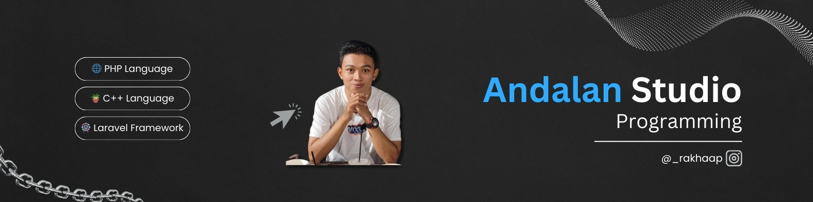

## Hi there I'm a shadow👋

<!--
**studioorg/studioorg** is a ✨ _special_ ✨ repository because its `README.md` (this file) appears on your GitHub profile.
ora
Here are some ideas to get you started:

- 🔭 I’m currently working on ...
- 🌱 I’m currently learning ...
- 👯 I’m looking to collaborate on ...
- 🤔 I’m looking for help with ...
- 💬 Ask me about ...
- 📫 How to reach me: ...
- 😄 Pronouns: ...
- ⚡ Fun fact: ...
-->

- 🔭 I’m currently working on **@andalanstudio**
- 👯 I’m looking to collaborate on code
- 🌱 I’m currently learning **Laravel** and **BPJS** framework
- 🤔 I’m looking for help with **my self**

   
  
  
   
   
 